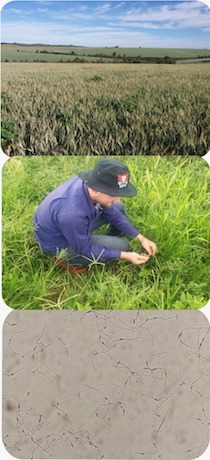

```{r setup, include=FALSE}
knitr::opts_chunk$set(
	echo = FALSE,
	message = FALSE,
	warning = FALSE
)
library(flexdashboard)
library(prettydoc)
library(readxl)
library(tidyverse)
library(crosstalk)
library(plotly)
library(viridis)
library(gsheet)
library(leaflet.providers)
library(leaflet)
library(DT)
library(cowplot)
```


```{r load data, message=FALSE, warning=FALSE, include=FALSE}
Sys.setlocale("LC_ALL", "pt_BR.UTF-8")


mg_prod <- gsheet2tbl("https://docs.google.com/spreadsheets/d/13xAflAQ-x78Vkq0O0jUEkUxHPq5G1R4gwqzillMxoTo/edit?usp=sharing")

wb1 <- gsheet2tbl("https://docs.google.com/spreadsheets/d/1x3KKDGIwdPQdG3YE5Ekn1iExMrqV76ndJbXAgLe7dsA/edit?usp=sharing")

wb2<- gsheet2tbl("https://docs.google.com/spreadsheets/d/1W5nJWJwQJRKyUfWeiQNNA2xdQUsbEeCX6g6FH_i7i4o/edit#gid=532754791")


wb_all <- wb2 %>%
  filter(labcode != 0) %>%
    mutate(id = case_when(
    is.na(py_binomial) ~ "No",
    TRUE ~ "Yes"
  )) %>%
  mutate(wheat = case_when(
    host_binomial == "Triticum aestivum" ~ "Wheat",
    TRUE ~ "Non-wheat"
  ))

wb_all <- wb_all %>% 
  dplyr::select(labcode, year, state_province, county_municipality, lat, lon, host_binomial, py_binomial,  py_lineage, primer, seq_locus, wheat, DNA_extraction)

set.seed(1000)
wb_all$lat <- round(jitter(wb_all$lat, factor = 1, amount = 0.001), 4)
wb_all$lon <- round(jitter(wb_all$lon, factor = 1, amount = 0.001), 4)

```


```{r all table, echo=FALSE}
sd <- SharedData$new(wb_all)
sd2 <- SharedData$new(wb_all)
```


Dashboard 
============


Column {.sidebar}
-------------------------------------


### Quick filter


```{r}
filter_slider("year", "Select years", sd, ~year)
filter_checkbox("wheat", "Host group", sd, ~wheat, inline = TRUE)
filter_select("host", "Host binomial", sd, ~host_binomial)
filter_checkbox("DNA_extraction", "DNA extracted?", sd, ~ DNA_extraction, inline = TRUE)
filter_select("py_species", "Pyricularia sp.", sd, ~py_binomial)


```


Column {.tabset}
-------------------------------------


### <i class="fa fa-map" aria-hidden="true"></i> Map strains

```{r}
library(RColorBrewer)
library(htmltools)
pal <- colorFactor("Set2", domain = c("Wheat", "Non-wheat"))

leaflet(data = sd, width = "100%") %>%
 # setView(-46.8, -20.40, zoom = 7) %>%
  addProviderTiles("Esri.WorldImagery", group = "Aerial") %>%
  addProviderTiles("OpenTopoMap", group = "Terrain") %>%
  addScaleBar("bottomright") %>%
  addProviderTiles(providers$CartoDB.Voyager, group = "Default") %>%
  addLayersControl(
    baseGroups = c("Default", "Aerial", "Terrain"),
    overlayGroups = "Blast pathogen",
    options = layersControlOptions(collapsed = T)
  ) %>%
  addCircleMarkers(
  
    group = "wheat",
    radius = 6,
    fillOpacity = 1,
    weight = 0.5,
    label = paste(wb_all$host, "- Details"),
    fillColor = ~ pal(wheat),

    popup = paste(
      "<h3>Isolate details</h3>",
      "Code:", wb_all$"labcode", "<br>",
      
      "Host:", wb_all$"host_binomial", "</i>", "<br>",
       "City:", wb_all$"county_municipality", "<br>",
      "Year:", wb_all$"year", "<br>",
      "DNA extraction:", wb_all$"DNA_extraction", "<br>",
      "Species:<i>", wb_all$"py_binomial", "<br></i>",
        "Lineage:<i>", wb_all$"py_lineage", "<br></i>"
    )
  ) %>%
  addLegend("bottomleft",
    pal = pal,
    values = ~wheat,
    title = "Host",
    opacity = 1
  ) %>% 
  
  addMeasure(
    position = "bottomleft",
    primaryLengthUnit = "meters",
    primaryAreaUnit = "sqmeters",
    activeColor = "#3D535D",
    completedColor = "#7D4479") %>% 
  addEasyButton(easyButton(
    icon="fa-globe", title="Zoom to Level 3",
    onClick=JS("function(btn, map){ map.setZoom(3); }"))) 
```


### <i class="fa fa-table" aria-hidden="true"></i> View grid display


```{r}
datatable(sd,
  extensions = c("Buttons", "ColReorder"),
  escape = TRUE, rownames = FALSE,
  class = "cell-border stripe",
  options = list(
    dom = "Bfrtip", buttons = c("excel", "pdf"), deferRender = TRUE,
    scrollY = 50,
    pageLength = 15,
    scroller = TRUE,
    colReorder = TRUE
  )
)
```


### <i class="fa fa-chart-bar" aria-hidden="true"></i> Charts


```{r}

p1 <- 
  plot_ly(wb_all, x = ~host_binomial) %>% 
add_histogram()
  
p2 <- wb_all %>% 
  count(py_binomial) %>%
  plot_ly(x = ~py_binomial, y = ~n) %>% 
  add_bars()


subplot(p1, p2) %>% hide_legend()

```


About this dashboard
============


Column {.sidebar}
-------------------------------------


Column {.tabset}
-------------------------------------


### About this project


<h3>What is <b>Pyblastr</b>?</h3>

> A  <u>database</u> of information on characterized fungal strains of <i>Pyricularia</i>, the genus that encompasses a complex of species that cause blast symptoms on both leaves and reproductive organs of agriculturally important Poacea (eg. wheat blast) and grasses in general, including turfgrass. 

<h3>What is it useful for?</h3>
>The dashboard contains tabular and graphical elements for displaying information for a georeferenced *Pyricularia* strain of a distinct species and host-specific lineages (or pathotypes) isolated from both wheat and grasses. Combined with the informaton on the year of sampling, it allows to track the temporal and spatial spread of the pathogen.

<h3>Who are we?</h3>
><b>Pyblastr</b> was created during the conduction of PhD research projects at the Plant Disease Epidemiology Laboratory (Dr. Emerson Del Ponte) in collaboration with Dr. Mark Farman (University of Kentucky). The first version was released on February 2020 and is expected to be continuously updated. 

<h3>May I contribute data?</h3>
>Yes! definitely. All datasets and codes for are built using open source tools and are available on [GitHub](https://github.com/emdelponte/pyblastr). We would like to extend  the utility of this project by allowing other researches to contribute data to populate the global map. Get in touch (delponte@ufv.br) to receive instructions on how to participate and include your data.


<h3>Current contributors</h3>


Dr. Emerson Del Ponte (UFV, Viçosa Brazil)  
Dr. Mark Farman (U.K. Lexington, US)  
MSc. João Ascari  (UFV, Viçosa Brazil)  
MSc. Ignácio Cazón (UFV, Viçosa Brazil)


<h3> Key wheat blast resources</H3>
<blockquote>
Reviews  
[Wheat blast diseases: danger on the move](https://link.springer.com/article/10.1007/s40858-017-0159-z)  
[Wheat blast: past, present and future](https://www.annualreviews.org/doi/abs/10.1146/annurev-phyto-080417-050036)  
[Wheat blast: from its origins in South America to its emergence as a global threat](https://bsppjournals.onlinelibrary.wiley.com/doi/full/10.1111/mpp.12747)

Websites   
[ Open Wheat Blast Initiative](http://openwheatblast.net/)   | 
[Cimmyt](https://www.cimmyt.org/news/what-is-wheat-blast/)   |  [ CABi](https://www.cabi.org/isc/datasheet/121970)  

Webinars  
[ Wheat Blast: Epidemiology and management of an emerging global threat. Dr. Cruz ](https://www.youtube.com/watch?v=gf1UFz926og&amp;t=1188s)  
[ Symptoms of Wheat Blast Under Controlled Conditions, P.K. Malaker](https://www.youtube.com/watch?v=9KfqahgmASE)  
[ Wheat blast infected field in Bangladesh, 2017. Dr. Malaker](https://www.youtube.com/watch?v=pnD3qCRruK8)  
</blockquote>


Enjoy our project!
<br>
<br>

<br>
<br>
<br>
<br>


### How to use it


Under development.


