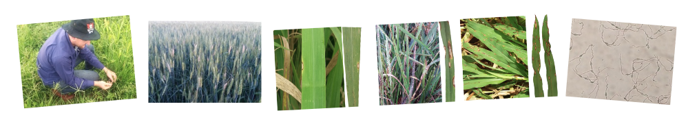

**Pyblastr** is a database of information on characterized fungal strains of Pyricularia, the genus that encompasses a complex of species that cause blast symptoms on both leaves and reproductive organs of agriculturally important Poacea (eg. wheat blast) and grasses in general, including turfgrass. Geographic information combined with the informaton on the year of sampling, it allows to track the temporal and spatial spread of the pathogen.

All datasets and codes for are built using open source tools and are available on [GitHub](https://github.com/emdelponte/pyblastr). We would like to extend the utility of this project by allowing other researches to contribute data to populate the global map. Get in touch ([delponte\@ufv.br](mailto:delponte@ufv.br){.email}) to receive instructions on how to participate and include your data.

**Current contributors**

Dr. Emerson Del Ponte (UFV, Viçosa Brazil)\
Dr. Mark Farman (U.K. Lexington, US)\
MSc. João Ascari (UFV, Viçosa Brazil)\
MSc. Ignácio Cazón (UFV, Viçosa Brazil)
